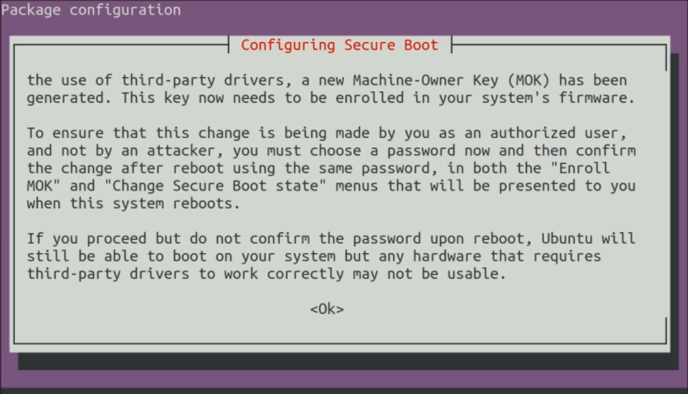
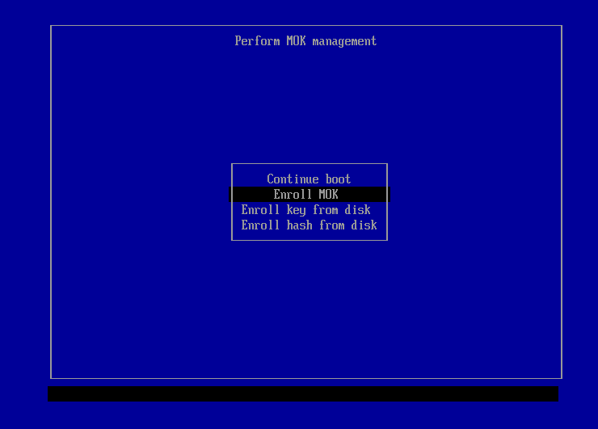

## Overview

To simplify the process of using Slamcore SDK this repository provides a DKMS package that adds support for Intel RealSense D435i and D455 cameras on various ARM platforms. We may also support some of the newer kernels on x86 platforms.

### Requirements

The package has been tested and is compatible with:
* Ubuntu 18.04 (64-bit) on Raspberry Pi 4.
* Ubuntu 20.04 (64-bit) on Raspberry Pi 4.
* Nvidia Jetson platforms running L4T versions 32.4.4 through to 36.2.0.
* Ubuntu 20.04 (amd64) running the 5.14 OEM kernel.
* Ubuntu 20.04 (amd64) running the 5.13 or 5.15 HWE kernel.
* Ubuntu 22.04 (amd64) running the 5.15 generic kernel.
* Ubuntu 22.04 (amd64) running the 5.19 HWE kernel.
* Ubuntu 22.04 (amd64) running the 6.2 HWE kernel.

## Installation

In order to install the package on a supported platform/OS combination, please download a Debian package from the [Releases section](https://github.com/slamcore/slamcore-dkms/releases). Then install it with `apt` like so:

```
# On Ubuntu 18.04 / Jetpack 4 arm64 platforms
sudo apt install ./slamcore-dkms_*-bionic_arm64.deb

# On Ubuntu 20.04 / Jetpack 5 arm64 platforms
sudo apt install ./slamcore-dkms_*-focal_arm64.deb

# On Ubuntu 20.04 for amd64
sudo apt install ./slamcore-dkms_*-focal_amd64.deb

# On Ubuntu 22.04 for amd64
sudo apt install ./slamcore-dkms_*-jammy_amd64.deb

# On Jetpack 6 arm64 platforms
sudo apt install ./slamcore-dkms_*-jammy_arm64.deb
```

And then reboot in order to complete the installation:

```
sudo reboot
```

## Troubleshooting

### Secure Boot Machine-Owner Key (MOK) enrollment process

If your x86 machine has Secure Boot enabled, you may be presented with the following screen when trying to install the `slamcore-dkms` package:




This screen allows you to configure and set the MOK, a secure boot component implemented by the BIOS (Learn more [here](https://wiki.debian.org/SecureBoot)). By setting a key, you will approve and allow the downloaded package to be installed correctly and brought up when rebooting. If you do not set a key, the  `slamcore-dkms` package will not be installed properly and you may continue to experience camera issues.
#### Solution

Follow the instructions presented and press OK on the previous screens. An MOK key/password prompt will appear where you have to enter a new MOK key/password. This password will be requested by the BIOS during the next reboot. At this stage, Slamcore tools that require this kernel module should still **not** be functional.

After this, reboot your machine. You may get the following screen (it might differ depending on BIOS / manufacturer):



Select the "Enroll MOK" option and continue. You will be prompted to enter the password you created previously.

Finally you should reach a screen similar to this:


Select "Continue boot". Your machine should now boot, and the Slamcore tools should now work as expected with the RealSense camera.

## License

This repository consists of sources from various [Linux kernel](https://developer.nvidia.com/embedded/l4t/r32_release_v6.1/sources/t186/public_sources.tbz2) [trees](http://ports.ubuntu.com/ubuntu-ports/ubuntu-ports/ubuntu-ports/pool/universe) as well as patches that either come directly from or have been modified based on patches from [librealsense2-dkms](https://github.com/IntelRealsense/librealsense).

The Linux kernel sources are covered by a [variety of licenses](https://github.com/torvalds/linux/tree/master/LICENSES).

The udev rules and the patches that come from Intel RealSense are covered by an [Apache 2 license](https://github.com/IntelRealSense/librealsense/blob/master/LICENSE).

Anything else in this repository that does not come from these sources is covered by an [Apache 2 license](https://github.com/slamcore/slamcore-dkms/blob/master/LICENSE.md).
